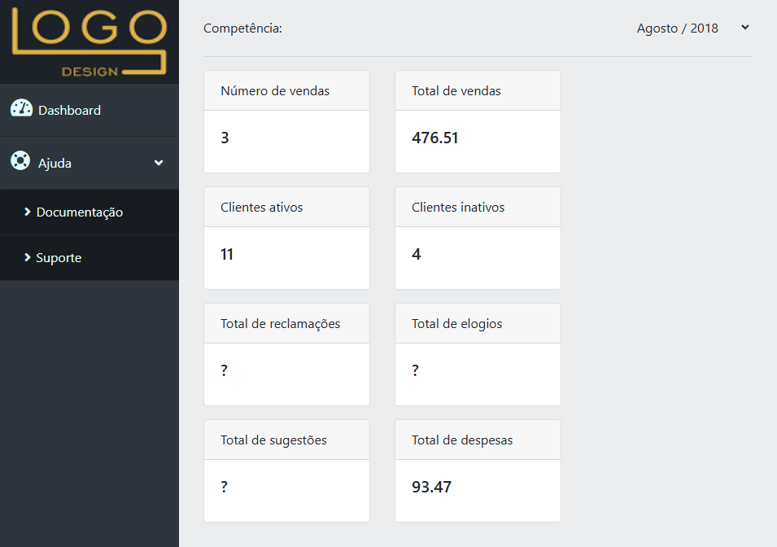
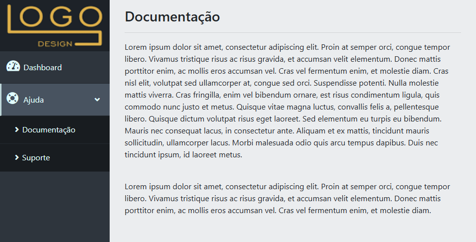

# App Dashboard
 
Curso online:

Domine Web - 20 Cursos - HTML5, CSS3, SASS, Bootstrap, JS, ES6, PHP, MySQL, JQuery, MVC, APIs, IONIC e muito mais

Autores:
Jorge Sant Ana e Jamilton Damasceno

Construção de um dashboard de vendas utilizando HTML, CSS, JQuery e PHP. 

>Figura 1: Dashboard

 
>Figura 2: Documentação

